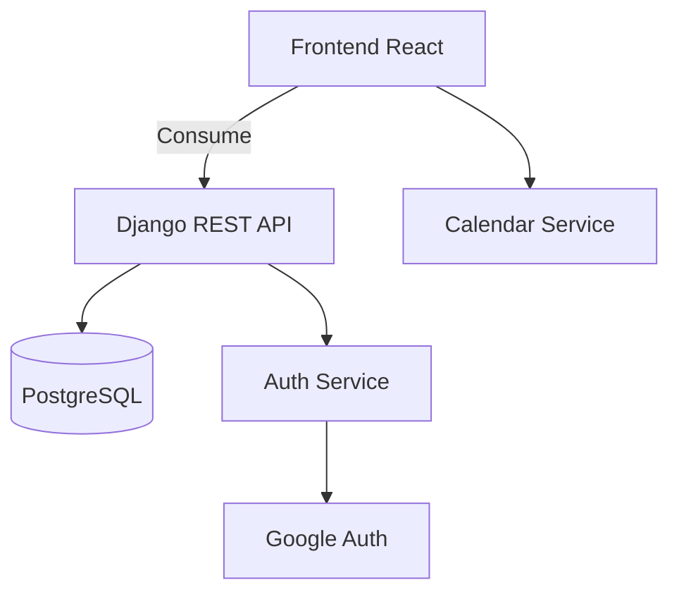

# 🎓 Plataforma Educativa para Gestión de Eventos Académicos

<div align="center">
  
</div>

---

## 📋 Descripción General

Plataforma web moderna para la gestión integral de eventos académicos que permite:

- 🗓️ **Programación inteligente** de eventos y calendario compartido
- 📝 **Inscripciones automatizadas** con validación en tiempo real
- 📢 **Difusión centralizada** de noticias facultativas
- 👨‍🏫 **Gestión completa** para administradores y participantes

---

## 🚀 Características Principales

### 🎯 Inscripción a Eventos
- Formularios dinámicos por tipo de evento  
- Límites de capacidad configurables  
- Confirmación por email/notificación  

### 📅 Calendario Académico
- Vista mensual/semanal/diaria 
- Recordatorios automáticos  

### 📌 Gestión de Contenidos
- Panel administrativo intuitivo  
- Categorización por carreras/departamentos  

### 🔔 Notificaciones
- Alertas personalizables  
- Multi-canal (email, push, SMS)  
- Programación de avisos  

---

### 🗂 Estructura del Proyecto
```bash
src/
├── 📁 assets/            # Recursos estáticos
├── 📁 components/        # Componentes reusables
│   ├── Banner.jsx        # Componente de cabecera
│   ├── Cards.jsx         # Tarjetas de eventos
│   ├── FormularioG.jsx   # Formulario genérico
│   └── ...               # (otros componentes)
├── 📁 views/             # Vistas principales
│   ├── CharlasView.jsx   # Vista de charlas
│   ├── Login.jsx         # Autenticación
│   └── ...               # (otras vistas)
└── 📁 styles/            # Estilos CSS
```

## 🏗 Arquitectura del Sistema


### 🛠 Stack Tecnológico - Frontend

| **Componente** | **Tecnología**   | **Versión** |
|---------------|------------------|-------------|
| Framework     | React.js         | 18.2+       |
| Lenguaje      | JavaScript       | ES6+        |
| Estilos       | CSS Modules      | -           |
| Routing       | React Router     | 6.4+        |
| Gestión de Estado | Context API   | Incluido    |
| HTTP Client   | Axios            | 1.2+        |

### Backend
Componente	Tecnología	Versión
Framework	Django	4.1+
API	Django REST Framework	3.14+
Base de Datos	PostgreSQL	14+

### ⚙️ Requisitos del Sistema

##### Frontend
Node.js 16.x o superior
NPM 8.x+
Navegador moderno (Chrome, Firefox, Edge)

##### Backend
Python 3.9+
PostgreSQL 14+
pip 22.x+

### 🛠 Instalación
```bash
# 1. Clonar repositorio
git clone https://github.com/GabooMedina/Celula-Academica.git

# 2. Instalar dependencias frontend
cd frontend && npm install

# 3. Configurar backend (requiere virtualenv)
cd ../backend && pip install -r requirements.txt

# 4. Iniciar servidores
npm start  # Frontend (puerto 3000)
python manage.py runserver  # Backend (puerto 8000)
```
### 👤 Autor
Gabriel Medina
Daniel Izurieta
